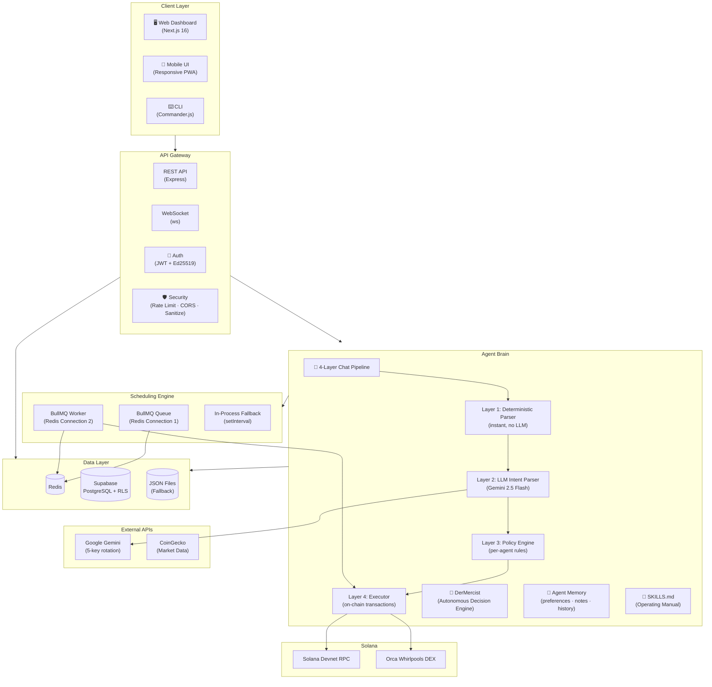

# 🛡️ SolAegis

## Autonomous AI Agent Platform for Solana DeFi

SolAegis is a **self-custodial, AI-powered autonomous agent platform** on Solana. Users create intelligent agents that manage, monitor, and execute on-chain operations through **natural language chat**. Each agent has its own isolated encrypted wallet, risk-aware execution engine, persistent memory, and structured operating manual.

**Built with:** TypeScript · Next.js 16 · Express · Supabase · BullMQ · Redis · Solana Web3.js · Google Gemini 2.5 · Orca Whirlpools

---

## Architecture



### Chat Pipeline Flow

```
User Message → Deterministic Pre-Parser → LLM Intent Parser → Policy Engine → Executor
                     │                          │                   │             │
              Regex matching           Gemini 2.5 Flash      Per-agent rules   On-chain tx
              for common commands      for ambiguous msgs     + rate limits     + audit log
              (instant, no cost)       (structure JSON)       (never bypassed)  + memory
```

---

## ⚡ Key Features

### 🤖 4-Layer Chat Pipeline
- **Layer 1 — Deterministic Parser:** Regex-based instant matching for unambiguous commands
- **Layer 2 — LLM Intent Parser:** Google Gemini 2.5 Flash with structured JSON output. 13 intent types supported
- **Layer 3 — Policy Guard:** Per-agent action whitelist, SOL limits, daily tx caps. Never bypassed
- **Layer 4 — Executor:** Builds, signs, and sends Solana transactions. Results streamed via WebSocket
- **Time-aware parsing:** "transfer 0.5 SOL to XYZ **in 6 hours**" → delay intent, not immediate execution
- **Multi-command support:** "swap 0.05 SOL to USDC **and** check my balance" → 2 intents

### ⛓️ On-Chain Skills
| Skill | Description |
|-------|-------------|
| **Swap** | Token swaps via Orca Whirlpools (SOL ↔ devUSDC, etc.) |
| **Transfer** | Send SOL/SPL tokens to any address |
| **Airdrop** | Request devnet SOL airdrop |
| **Scam Check** | Analyze token safety — freeze auth, mint auth, supply concentration |
| **Recovery** | Close empty/dust token accounts → reclaim rent SOL |
| **Scan Airdrops** | Enumerate all token accounts, flag suspicious/low-value tokens |
| **Balance** | SOL + all SPL token balances with valuations |
| **Market Data** | Live SOL price, 24h change, volume, market cap from CoinGecko |

### ⏰ BullMQ Scheduling Engine
- **Repeating cron jobs:** "scan for scams every 6 hours" → BullMQ repeating job
- **One-shot delayed jobs:** "transfer 0.5 SOL in 3 hours" → delayed BullMQ job
- **Dedicated Worker connection:** Queue and Worker use separate Redis connections (BullMQ requirement)
- **Retry + timeout:** 3 retries with exponential backoff, 30s job timeout, concurrency 3, rate limit 5/min
- **Audit trail:** All scheduled job results logged to audit + memory, visible in History panel
- **Natural language intervals:** `"every 5 minutes"`, `"daily"`, `"in 6 hours"`, `"after 30 min"`
- **In-process fallback:** If Redis is unavailable, `setInterval`-based scheduler activates

### 📖 Structured SKILLS.md Operating Manual
Each agent loads a machine-readable `SKILLS.md` at runtime that defines:
- **Core directives** — gas reserve rule, risk enforcement, no hallucinations
- **JSON output schema** — exact intent format for deterministic LLM output
- **13 capability definitions** — each with action name, parameters, and example JSON
- **Standard operating procedures** — workflows for safe swapping, wallet deep clean, delayed transfers
- **Intent priority rules** — time qualifiers > action detection, "every" → schedule, etc.

Agents reload skills on command: _"reload skills"_ → re-reads from disk dynamically.

### 📡 WebSocket Streaming
- Real-time character-by-character streaming (8 chars at 4ms intervals — typing effect)
- WebSocket and HTTP paths support full intent parity: `execute_action`, `schedule`, `delay`, `unschedule`
- Auto-reconnect with 3s backoff, 45s client timeout
- Broadcast events: `cron:executed`, `cron:failed`, `cron:delayed`, `agent:funded`, `config:updated`

### 🧠 DerMercist AI Decision Engine
Autonomous agent loop: LLM suggests action → Rules Engine validates → Risk Engine approves → Execute
- 15+ deterministic safety rules (max trade size, cooldown periods, balance thresholds)
- Decision memory with per-action stats, adaptive cooldowns, risk score history
- Position tracking with on-chain portfolio snapshots and PnL calculation

### 🔐 10-Layer Security
| Layer | Protection |
|-------|-----------| 
| Wallet Signature Auth | Ed25519 signature verification via Phantom/Solflare |
| JWT Auth | Password-based with encrypted store (AES-256-GCM) |
| Prompt Injection Guard | Pattern detection for `ignore instructions`, role hijacking |
| Input Sanitizer | HTML/XSS stripping on all request bodies |
| Rate Limiting | Per-IP: chat 10/min, transactions 5/min |
| Agent Ownership | JWT user → agent ownership map, cross-user access blocked |
| Policy Engine | Per-agent action whitelist, maxSolPerTx, dailyTxLimit |
| Scheduler Guardrails | Max 20 active jobs, cron pattern validation |
| Encrypted Keys | AES-256-GCM for wallet keypairs + LLM API keys |
| Audit Logging | Every action logged to Supabase + in-memory (dual-write) |

### 🗄️ Data Persistence
| Data | Primary | Fallback |
|------|---------|----------|
| Agents | Supabase `agents` table | JSON files on disk |
| Memory | Supabase `agent_memory` | `data/agents/{id}/memory.json` |
| Scheduled Jobs | Supabase `scheduled_jobs` + Redis | In-process timers |
| Audit Log | Supabase `audit_log` | In-memory (last 1000) |
| Wallets | AES-256-GCM `.wallets.json` | — |

### 🧪 LLM Resilience
- **5-key rotation** with round-robin cycling across Gemini API keys
- **Per-key blacklisting** after 3 consecutive failures (2-minute cooldown)
- **Exponential backoff** between retries (500ms → 1s → 2s)
- **Fallback model:** gemini-2.0-flash when primary (2.5-flash) fails
- **30-second request timeout** with AbortController

---

## ⌨️ CLI — `@solaegis/cli`

API-first terminal interface that mirrors the full web dashboard. All commands go through the REST API.

```bash
# Run with:
npx tsx cli/index.ts <command>
# Or via npm script:
npm run cli -- <command>
```

### Authentication
```bash
solaegis auth login -u <username> -p <password>
solaegis auth register -u <username> -p <password>
solaegis auth wallet-verify -a <wallet-address>
```

### Agent Management
```bash
solaegis agents list
solaegis agents create -n "TraderBot" -r trader --risk medium
solaegis agents delete -a <agent-id>
```

### Chat (LLM Intent Pipeline)
```bash
# Immediate actions
solaegis chat -a <id> "Swap 1 SOL for USDC"
solaegis chat -a <id> "What's my balance?"

# Delayed actions
solaegis chat -a <id> "Transfer 0.5 SOL to XYZ in 6 hours"

# Scheduled actions
solaegis chat -a <id> "Scan for scams every 6h"

# Multi-command
solaegis chat -a <id> "Check balance and scan for scams"
```

Output shows: parsed intents (color-coded), execution results, and policy decisions.

### Agent Skills & Config
```bash
solaegis skills -a <id>                           # View loaded SKILLS.md
solaegis config show -a <id>                      # View agent config
solaegis config update -a <id> --risk low         # Update risk profile
solaegis config update -a <id> --max-sol 0.1      # Set max SOL per tx
```

### Scheduling & Analytics
```bash
solaegis jobs list -a <id>                        # List scheduled jobs
solaegis jobs remove -n <job-name>                # Remove a job
solaegis history -a <id>                          # Action history
solaegis audit -a <id>                            # Security audit log
solaegis market                                   # SOL price & market data
```

---

## Project Structure

```
solaegis/
├── backend/
│   ├── core/
│   │   ├── agent.ts              Agent class with state and skills
│   │   ├── agentManager.ts       Agent lifecycle management
│   │   ├── agentConfig.ts        loadAgentConfig, loadSkills, updateConfig
│   │   ├── chatHandler.ts        4-layer NLP chat pipeline (13 intent types)
│   │   ├── memory.ts             Persistent memory (Supabase + file)
│   │   └── dermercist/           AI decision engine
│   │       ├── index.ts          Orchestration loop
│   │       ├── agentPlanner.ts   LLM + rules task prioritization
│   │       ├── llmInterface.ts   Structured LLM queries
│   │       └── rules.ts          Deterministic safety rules (15+)
│   │
│   ├── services/
│   │   ├── supabaseClient.ts     Supabase singleton (service role)
│   │   ├── supabaseStore.ts      Full CRUD for all 4 tables
│   │   ├── policyEngine.ts       Per-agent action policy enforcement
│   │   ├── marketData.ts         CoinGecko SOL price (60s cache)
│   │   ├── walletService.ts      AES-256-GCM encrypted wallet management
│   │   ├── decisionMemory.ts     DerMercist decision history
│   │   ├── positionTracker.ts    On-chain portfolio snapshots
│   │   └── executionLock.ts      Concurrency lock for transactions
│   │
│   ├── skills/
│   │   ├── defiSkill.ts          Skill orchestrator
│   │   ├── swap.ts               Orca Whirlpool token swaps
│   │   ├── transferSpl.ts        SPL token transfer with ATA creation
│   │   ├── airdropScanner.ts     Token account enumeration
│   │   ├── solRecovery.ts        Empty account recovery + rent reclaim
│   │   └── scamFilter.ts         Freeze/mint auth, supply concentration
│   │
│   ├── llm/
│   │   ├── keyStore.ts           Encrypted multi-key storage
│   │   └── llmManager.ts         5-key rotation + blacklisting + fallback
│   │
│   ├── scheduler/
│   │   └── cronEngine.ts         BullMQ with dedicated Worker connection
│   │
│   ├── security/
│   │   ├── auth.ts               JWT + Ed25519 wallet signature auth
│   │   ├── auditLog.ts           Dual-write audit logging
│   │   ├── rateLimiter.ts        Per-IP rate limiting
│   │   ├── inputSanitizer.ts     HTML/XSS stripping
│   │   └── injectionGuard.ts     Prompt injection detection
│   │
│   └── index.ts                  Express + WebSocket entry point (46 routes)
│
├── cli/
│   └── index.ts                  Commander.js API-first CLI (10 command groups)
│
├── frontend/
│   └── app/
│       ├── page.tsx              Main app — auth, agents, chat, WS streaming
│       └── components/
│           ├── Sidebar.tsx       Agent list with wallet balances
│           ├── ExecutionStream.tsx  Desktop chat with SOL ticker
│           ├── ExecutionBlock.tsx   Message bubbles (auto-linked addresses)
│           ├── CommandInput.tsx     Smart input with suggestion chips
│           ├── RiskPanel.tsx       5-tab panel: Config/Memory/Schedule/History/Info
│           ├── MobileChatView.tsx   Mobile-optimized full-screen chat
│           ├── MobileActionSheet.tsx  Bottom action sheet
│           └── MobileSettingsDrawer.tsx  Swipe-up settings
│
├── data/agents/{id}/
│   ├── config.json               Per-agent configuration
│   ├── memory.json               Persistent preferences + notes
│   └── SKILLS.md                 Agent-specific operating manual
│
├── SKILLS.md                     Default operating manual template
└── README.md
```

---

## Chat Commands

| Command | Example | Intent Type |
|---------|---------|-------------|
| Swap tokens | _"swap 0.05 SOL to USDC"_ | `execute_action` → swap |
| Transfer | _"send 0.01 SOL to 9xK..."_ | `execute_action` → transfer |
| Delayed transfer | _"transfer 0.5 SOL to XYZ in 6 hours"_ | `delay` → transfer |
| Delayed swap | _"swap 1 SOL for USDC in 30 min"_ | `delay` → swap |
| Schedule task | _"scan for scams every 6h"_ | `schedule` → scam_check |
| Cancel schedule | _"stop scanning for scams"_ | `unschedule` |
| Check balance | _"what's my balance?"_ | `query_balance` |
| SOL price | _"what's the SOL price?"_ | `market_query` |
| Scam scan | _"is this token safe?"_ | `execute_action` → scam_check |
| Recover SOL | _"recover unused accounts"_ | `execute_action` → recover |
| Airdrop | _"airdrop me some SOL"_ | `execute_action` → airdrop |
| Remember | _"I prefer conservative strategies"_ | `remember` |
| Multi-command | _"check balance and scan for scams"_ | Multiple intents |
| Update config | _"switch to low risk"_ | `update_config` |

---

## Prerequisites

- **Node.js** 18+
- **Redis** (recommended for scheduling — degrades gracefully without it)
- **Supabase** project (free tier works)

---

## Installation

```bash
git clone https://github.com/michealimuse777/SolAegis.git
cd SolAegis
npm install
cd frontend && npm install && cd ..
```

---

## Configuration

### Environment Variables

| Variable | Required | Description |
|----------|----------|-------------|
| `MASTER_KEY` | ✅ | 64-char hex for AES-256 encryption |
| `SOLANA_RPC_URL` | — | Defaults to `https://api.devnet.solana.com` |
| `REDIS_URL` | — | Defaults to `redis://localhost:6379` |
| `SUPABASE_URL` | — | Supabase project URL |
| `SUPABASE_SERVICE_KEY` | — | Supabase service role key (server-side only) |
| `PORT` | — | REST API port (default: 4000) |
| `LLM_KEY_1` – `LLM_KEY_5` | — | Gemini API keys for 5-key rotation |

Generate a master key:
```bash
node -e "console.log(require('crypto').randomBytes(32).toString('hex'))"
```

### Supabase Setup

Run in Supabase Dashboard → SQL Editor:

```sql
CREATE TABLE IF NOT EXISTS agents (
  id TEXT PRIMARY KEY, owner_id TEXT NOT NULL, name TEXT NOT NULL,
  public_key TEXT, config JSONB DEFAULT '{}'::jsonb,
  skills_doc TEXT DEFAULT '', created_at TIMESTAMPTZ DEFAULT now()
);
CREATE TABLE IF NOT EXISTS agent_memory (
  agent_id TEXT PRIMARY KEY, preferences JSONB DEFAULT '{}'::jsonb,
  notes JSONB DEFAULT '[]'::jsonb, successful_actions JSONB DEFAULT '[]'::jsonb,
  last_failures JSONB DEFAULT '[]'::jsonb, updated_at TIMESTAMPTZ DEFAULT now()
);
CREATE TABLE IF NOT EXISTS audit_log (
  id BIGSERIAL PRIMARY KEY, agent_id TEXT NOT NULL, user_id TEXT,
  action TEXT NOT NULL, status TEXT NOT NULL, tx_signature TEXT,
  reason TEXT, params JSONB, ip TEXT, created_at TIMESTAMPTZ DEFAULT now()
);
CREATE TABLE IF NOT EXISTS scheduled_jobs (
  id BIGSERIAL PRIMARY KEY, agent_id TEXT NOT NULL, action TEXT NOT NULL,
  cron_pattern TEXT, interval_text TEXT, status TEXT DEFAULT 'active',
  bullmq_key TEXT, created_at TIMESTAMPTZ DEFAULT now()
);
ALTER TABLE agents ENABLE ROW LEVEL SECURITY;
ALTER TABLE agent_memory ENABLE ROW LEVEL SECURITY;
ALTER TABLE audit_log ENABLE ROW LEVEL SECURITY;
ALTER TABLE scheduled_jobs ENABLE ROW LEVEL SECURITY;
```

---

## Running

```bash
# Backend (REST + WebSocket on same port)
npm run dev

# Frontend (separate terminal)
cd frontend && npm run dev

# CLI
npm run cli -- agents list
npm run cli -- chat -a <id> "Swap 1 SOL for USDC"
npm run cli -- skills -a <id>
```

Backend: `http://localhost:4000` (REST + WS on same port)
Frontend: `http://localhost:3000`

---

## API Reference (46 endpoints)

### Auth
```
POST /api/auth/register         { username, password }
POST /api/auth/login            { username, password }
POST /api/auth/wallet/nonce     { address }
POST /api/auth/wallet/verify    { address, signature, nonce }
```

### Agents
```
GET    /api/agents
POST   /api/agents              { name, role?, riskProfile? }
DELETE /api/agents/:id
GET    /api/agents/:id/config
PATCH  /api/agents/:id/config   { riskProfile?, maxSolPerTx?, dailyTxLimit? }
POST   /api/agents/:id/chat     { message }
GET    /api/agents/:id/skills   → { agent, skills, meta }
GET    /api/agents/:id/schedules
GET    /api/agents/:id/history
GET    /api/agents/:id/memory
DELETE /api/agents/:id/memory
GET    /api/agents/:id/audit
GET    /api/agents/:id/portfolio
GET    /api/agents/:id/analytics
GET    /api/agents/:id/decisions
```

### Actions
```
POST /api/agents/:id/airdrop
POST /api/agents/:id/transfer-sol  { to, amount }
POST /api/agents/:id/swap          { inputToken, outputToken, amount }
POST /api/agents/:id/auto-recover
POST /api/agents/:id/execute       { action, params }
```

### Scheduler
```
GET    /api/cron/jobs
POST   /api/cron/schedule        { name, pattern, agentId, action }
DELETE /api/cron/jobs/:name
POST   /api/scheduler/schedule   (with guardrail middleware)
GET    /api/scheduler/jobs
```

### Market & System
```
GET /api/price/sol
GET /api/health
POST /api/tokens/check
POST /api/dermercist/run
POST /api/dermercist/run/:id
```

---

## Deployment

| Service | Host | Purpose |
|---------|------|---------|
| Frontend | Vercel | Auto-deploy from `main` |
| Backend | Railway | Single-port HTTP + WebSocket |
| Database | Supabase | PostgreSQL with Row Level Security |
| Queue | Railway Redis | Dedicated instance for BullMQ |

---

## License

MIT
