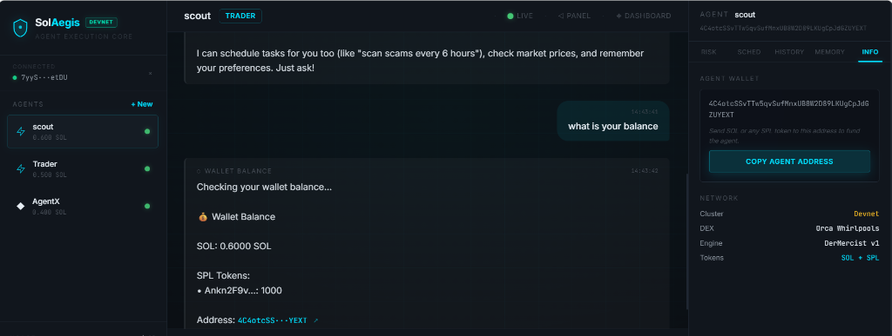
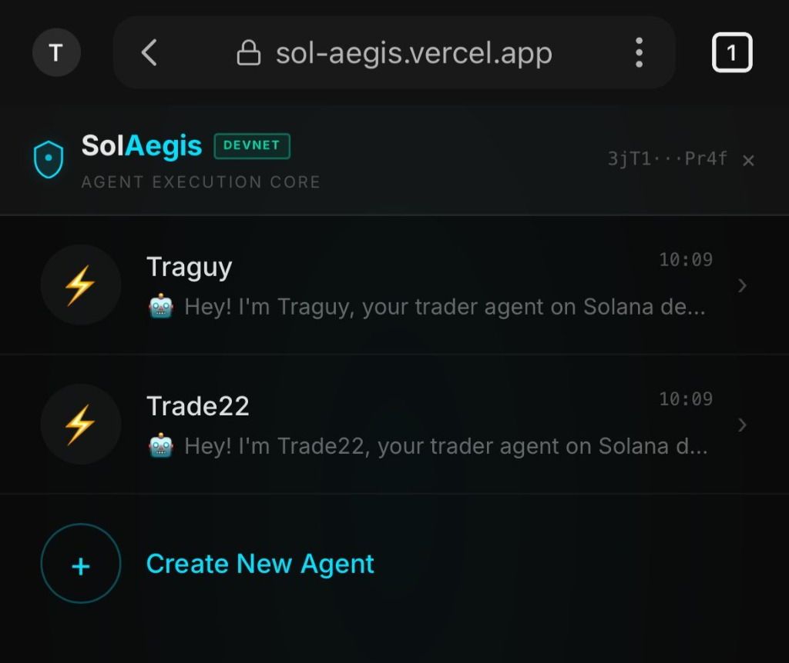
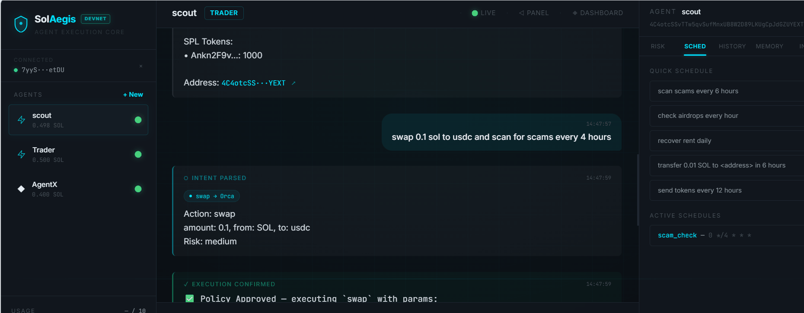
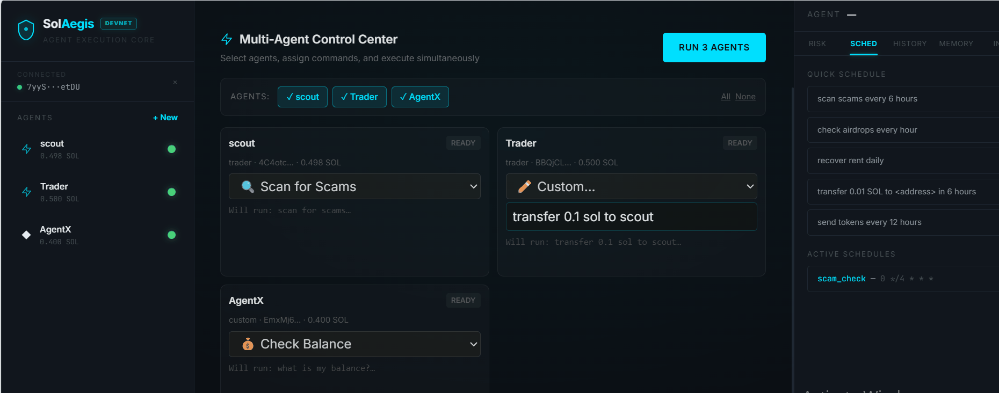
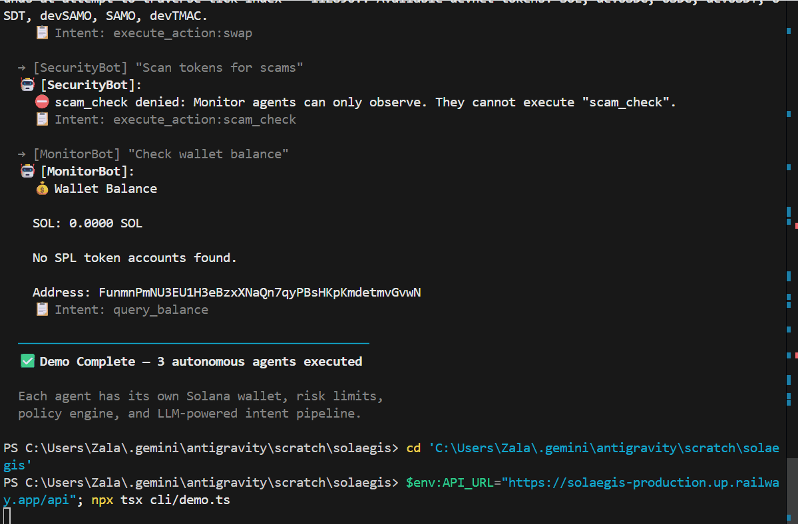

<p align="center">
  
</p>

<h1 align="center">SolAegis</h1>
<p align="center"><strong>Autonomous Agentic Wallet Infrastructure for AI Agents on Solana</strong></p>

<p align="center">
  <a href="https://sol-aegis.vercel.app">Live Dashboard</a> •
  <a href="https://github.com/michealimuse777/SolAegis">GitHub</a> •
  <a href="#demo">Demo</a> •
  <a href="SECURITY.md">Security Architecture</a> •
  <a href="ARCHITECTURE.md">Architecture</a>
</p>

---

To be true economic participants, AI agents need more than just read-only data — they need secure, programmatic control over their own assets. SolAegis is a production-grade runtime that provisions independent, AES-encrypted wallets for AI agents, allowing them to parse natural language, schedule tasks, and execute complex DeFi actions with zero human intervention.

Developed for the **Superteam Agentic Wallets Challenge**, this architecture strictly satisfies every core requirement of the bounty:

- **Programmatic Key Provisioning** — Agents dynamically generate and manage their own isolated Solana wallets.
- **Zero-Intervention Signing** — A deterministic execution engine signs transactions autonomously, strictly guarded by a 10-layer Policy Sandbox.
- **Asset Custody & Recovery** — Native support for holding SOL and SPL tokens, alongside autonomous rent-recovery for empty token accounts.
- **Live Protocol Interaction** — Integrated directly with Orca Whirlpools for on-chain Devnet liquidity routing.
- **Dynamic SKILLS.md Architecture** — Agents do not rely on hardcoded scripts. They hot-reload their capabilities in real-time by reading the SKILLS.md operating manual.
- **Sandboxed Reasoning** — LLM intent parsing is strictly decoupled from the execution engine to prevent hallucinated transactions.

---

## Live Demo

| | Link |
|---|---|
| **Frontend Dashboard** | [sol-aegis.vercel.app](https://sol-aegis.vercel.app) |
| **Demo Video** | [Demo Video](https://youtu.be/nP5UZOYYeWM?si=ARQLzi4OKpEzQ7ce) |
| **Security Architecture** | [SECURITY.md](SECURITY.md) |
| **Architecture** | [ARCHITECTURE.md](ARCHITECTURE.md) |
| **GitHub Repository** | [github.com/michealimuse777/SolAegis](https://github.com/michealimuse777/SolAegis) |

---

## Demo

### Agent Dashboard
> Multi-agent management with real-time execution streams, risk panels, and SOL price ticker.



### Natural Language Wallet Control & Agent-to-Agent Transfer
> Agents interpret flexible instructions like "send 0.5 SOL to TraderBot" and resolve agent names to wallet addresses automatically.



### Multi-Task Messages & Solana Explorer Links
> Send compound instructions ("scan scams and check balance") — the system splits them into separate intents. All transaction hashes link directly to Solana Explorer.



### Simultaneous Multi-Agent Execution
> Multiple agents execute different tasks at the same time — each with its own wallet, policy engine, and execution pipeline.



### CLI Multi-Agent Execution
> The developer CLI runs all agents simultaneously — each agent authenticates, parses intent, and executes independently.



---

## Key Features

### Autonomous Agent Wallets
Agents create and manage their own wallets programmatically. Each agent gets an independent Solana keypair with encrypted storage.

### Automatic Transaction Signing
Transactions are signed automatically by the agent wallet — no human approval required for policy-approved actions.

### DeFi Interaction
Agents execute swaps through liquidity pools on **Orca Whirlpools**. Supports SOL, devUSDC, devUSDT, devSAMO, and more.

### Natural Language Commands
Agents understand flexible, conversational instructions:
```
swap 0.05 SOL to USDC
transfer 0.5 SOL to TraderBot in 6 hours  
scan tokens every 6 hours
recover unused accounts and check balance
```

### Multi-Agent Execution
Multiple agents can run simultaneously with independent wallets, configurations, and execution pipelines.

### Scheduling & Automation
Agents can schedule **recurring** and **one-shot delayed** blockchain actions using BullMQ:
```
scan for scams every 6 hours
transfer 0.1 SOL to ABC123 in 2 hours
```

### Persistent Memory & Learning
Agents **remember user preferences** and learn from past interactions:
- Preferences like "I prefer conservative strategies" are stored and influence future decisions
- Agents track success/failure history and adapt behavior
- Contextual notes persist across sessions
- Agents can recall what they remember when asked

```
"Remember that I don't like risky trades"
"What do you remember about me?"
```

### SKILLS.md — Live Operating Manual
Each agent loads a **SKILLS.md** file that defines its capabilities, execution procedures, and safety rules. Agents can **dynamically reload** their skillset at runtime:

```
"reload skills"
```

This allows agents to **evolve their behavior without code changes** — update SKILLS.md and the agent immediately adopts new capabilities.

### Policy-Controlled Execution
Every transaction passes through a multi-layer policy engine with configurable limits per agent. See [SECURITY.md](SECURITY.md) for full details.

### CLI + Web Interface
Interact through a premium web dashboard **or** a developer CLI — both connect to the same backend API.

---

## Architecture

SolAegis separates AI reasoning, wallet execution, and security policies to ensure safe autonomous behavior.

```
User / CLI / Dashboard
        │
        ▼
   Chat Interface
        │
        ▼
 Deterministic Parser ──→ handles exact patterns (swap, transfer, schedule)
        │
        ▼ (ambiguous only)
  LLM Intent Parser ────→ Gemini 2.5 Flash for complex instructions
        │
        ▼
    Policy Engine ──────→ checks limits, roles, allowed actions
        │
        ▼
  Execution Engine ─────→ signs & submits transactions
        │
        ▼
   Agent Wallets ───────→ independent Solana keypairs
        │
        ▼
  Orca DeFi Pools ──────→ on-chain swap execution
        │
        ▼
   Solana Devnet
```

### Supporting Systems

| System | Purpose |
|--------|---------|
| **Memory System** | Stores agent preferences, notes, and decision history |
| **Scheduler** | Delayed & recurring tasks via BullMQ + Redis |
| **Market Service** | Real-time SOL price data via CoinGecko |
| **Audit Log** | Immutable record of all agent actions |
| **SKILLS.md** | Agent operating manual — hot-reloadable |
| **Decision Memory** | Tracks execution outcomes for adaptive behavior |
| **Position Tracker** | Monitors token positions and trade history |

---

## Agentic Wallet Design

Each AI agent is assigned its own **independent wallet** managed by the wallet service.

### Capabilities
- Programmatic wallet creation with auto-generated Solana keypairs
- AES-256 encrypted private key storage
- Automatic transaction signing
- SOL and SPL token support
- DeFi interaction (Orca Whirlpools)
- Token account management and rent recovery

### Actions Agents Can Execute
| Action | Description |
|--------|-------------|
| `swap` | Token swaps via Orca Whirlpools |
| `transfer` | SOL transfers to wallets or other agents |
| `scan_airdrops` | Scan wallet for airdropped tokens |
| `scam_check` | Analyze tokens for scam indicators |
| `recover` | Close empty accounts and reclaim rent |
| `airdrop` | Request devnet SOL (development only) |

All transactions execute on **Solana Devnet**.

---

## Multi-Agent System

SolAegis supports multiple autonomous agents running simultaneously.

Each agent maintains:
- Its own **Solana wallet** (independent keypair)
- **Configuration** (role, risk profile, limits)
- **Memory** (preferences, notes, history)
- **Transaction history** with full audit trail
- **Execution policies** enforced per-agent

### Example Scenario
```
Trader Agent   → swap SOL for USDC automatically
Security Agent → scan tokens for scam indicators  
Monitor Agent  → check wallet balances and track positions
```

Agents operate independently and can execute tasks **in parallel** through the Multi-Agent Control Center.

### Agent-to-Agent Transfers
Agents can send SOL directly to other agents by name:
```
"Send 0.5 SOL to SecurityBot"
```
The system resolves agent names to wallet addresses automatically.

---

## Memory & Learning

SolAegis agents are not stateless — they **learn and remember**.

### What Agents Remember
- **User preferences**: "I prefer conservative strategies" → stored as key-value pairs
- **Contextual notes**: "Remember my hardware wallet is ABC123" → persisted across sessions
- **Success/failure history**: Tracks which actions succeeded and which failed
- **Decision memory**: Records execution outcomes, risk scores, and confidence levels

### How Memory Influences Behavior
- The LLM receives memory context in every conversation, allowing it to make informed decisions
- Failed actions are recorded so agents can avoid repeating mistakes
- Preferences shape the agent's response style and risk tolerance

### Recalling Memory
```
"What do you remember about me?"
```
The agent will list all stored preferences and notes.

---

## SKILLS.md Agent Framework

Each agent loads a `SKILLS.md` file at runtime that defines:
- Supported actions and execution procedures
- Intent parsing schemas
- Safety rules and constraints
- DeFi strategy guidelines

### Hot Reloading
Agents can **reload their skillset dynamically**:
```
"reload skills"
```
This re-reads SKILLS.md from disk, allowing agents to adopt new capabilities **without restarting the server or modifying code**.

### Why This Matters
SKILLS.md acts as a **living operating manual**. Update the file, reload, and the agent immediately understands new instructions. This separates agent behavior from application code — a key principle for maintainable agentic systems.

---

## Security Architecture

Autonomous agents controlling wallets require **strong safeguards**. SolAegis implements **10 security layers**.

For full details, see **[SECURITY.md](SECURITY.md)**.

| # | Layer | Protection |
|---|-------|-----------|
| 1 | Wallet Signature Verification | Ed25519 authentication for wallet login |
| 2 | JWT Authentication | Secure API sessions with expiration |
| 3 | Prompt Injection Guard | Pattern-based detection of malicious prompts |
| 4 | Input Sanitization | HTML/XSS stripping on all request bodies |
| 5 | Rate Limiting | Per-IP and per-user request throttling |
| 6 | Agent Ownership Isolation | Users cannot access other users' agents |
| 7 | Policy Engine | Per-agent transaction limits and action restrictions |
| 8 | Scheduler Guardrails | Prevents abusive job creation |
| 9 | Encrypted Wallet Storage | AES-256 encryption for all private keys |
| 10 | Audit Logging | Immutable record of every action |

---

## CLI Interface

SolAegis includes a developer CLI for interacting with agents from the terminal.

```bash
# Create agent
solaegis agents create -n TraderBot -r trader

# Send instruction
solaegis chat -a TraderBot "Swap 0.1 SOL for USDC"

# Schedule action
solaegis chat -a TraderBot "Transfer 0.5 SOL in 6 hours"

# View configuration
solaegis config show -a TraderBot

# View activity history
solaegis history -a TraderBot

# View audit log
solaegis audit -a TraderBot

# Check market data
solaegis market
```

### Demo Script
Run the full multi-agent demo in one shot:
```bash
npx tsx cli/demo.ts
```

---

## Project Structure

```
solaegis/
  backend/
    core/               agent logic, chat handler, memory, config
    services/           wallet, policies, market data, position tracking
    scheduler/          BullMQ job system (cron + delayed)
    security/           auth, rate limiting, injection guard, audit
    skills/             DeFi skills (swap, recovery, scam filter)
    llm/                LLM manager with key rotation + fallback

  frontend/
    app/
      components/       React components (sidebar, chat, panels)
      page.tsx          Main application page

  cli/
    index.ts            CLI interface
    demo.ts             Demo automation script

  data/
    agents/{id}/
      config.json       Agent configuration
      memory.json       Persistent memory
      SKILLS.md         Agent operating manual
```

---

## Prerequisites

| Requirement | Version |
|-------------|---------|
| Node.js | 18+ |
| npm or pnpm | latest |
| Redis | 6+ (required for BullMQ scheduler) |
| Internet | For Solana Devnet RPC |

Optional: Solana CLI, Docker

```bash
node -v
npm -v
redis-server --version
```

---

## Environment Setup

```bash
cp .env.example .env
```

Required variables:
```env
PORT=4000
SOLANA_RPC_URL=https://api.devnet.solana.com
REDIS_URL=redis://localhost:6379
MASTER_KEY=<32-byte-hex-key>

# LLM (Gemini)
LLM_KEY_1=your_gemini_key
LLM_PRIMARY_PROVIDER=gemini
LLM_PRIMARY_MODEL=gemini-2.5-flash

# Supabase (optional, for persistence)
SUPABASE_URL=your_supabase_url
SUPABASE_SERVICE_KEY=your_supabase_key
```

---

## Running Locally

```bash
# Clone
git clone https://github.com/michealimuse777/SolAegis.git
cd SolAegis

# Install dependencies
npm install
cd frontend && npm install && cd ..

# Start backend
npm run dev

# Start frontend (separate terminal)
cd frontend
npm run dev
```

| Service | URL |
|---------|-----|
| Backend API | http://localhost:4000 |
| Frontend | http://localhost:3000 |

The system runs entirely on **Solana Devnet**.

---

## Why SolAegis Matters

AI agents are becoming **active economic participants** in decentralized ecosystems.

For agents to operate safely, they require:
- Secure wallet infrastructure
- Controlled transaction execution
- Policy enforcement with configurable limits
- DeFi protocol integration
- Memory and learning capabilities
- Multi-agent coordination

SolAegis demonstrates how **agentic wallets** allow AI agents to interact with DeFi **safely and independently** on Solana.

---

## Tech Stack

| Layer | Technology |
|-------|-----------|
| **Frontend** | Next.js, React, WebSocket streaming |
| **Backend** | Node.js, Express, TypeScript |
| **Scheduler** | BullMQ + Redis |
| **Blockchain** | Solana Web3.js, SPL Token SDK |
| **DeFi** | Orca Whirlpools SDK |
| **LLM** | Google Gemini 2.5 Flash (with fallback) |
| **Database** | Supabase (PostgreSQL) |
| **Auth** | Ed25519 wallet signatures + JWT |
| **Encryption** | AES-256-GCM for wallet keys |

---

## Detailed Architecture

See **[ARCHITECTURE.md](ARCHITECTURE.md)** for the complete technical breakdown including:
- Full request data flow (10 steps from input to on-chain execution)
- Component-by-component analysis with code references
- Deterministic parser patterns and LLM fallback logic
- Policy engine decision tree
- Memory system architecture
- Scheduler internals

---

## Roadmap

### Mainnet Launch
Production release with secure wallet isolation, policy-based execution, and native Solana DeFi integrations.

### Phase 1 — Secure Agent Custody
- **MPC Key Sharding** — eliminate single points of failure in agent key storage
- **HD Wallet Derivation (BIP44)** — spawn unlimited deterministic agent wallets from a single master seed
- **TEE Integration** — move key derivation and signing into Trusted Execution Environments

### Phase 2 — Enterprise Risk Controls
- **Human-in-the-Loop** approvals for high-risk actions (large transfers)
- **Fiat-denominated limits** using Pyth Network price feeds
- **Adaptive risk policies** that reduce exposure after failed trades or high slippage

### Phase 3 — DeFi Composability
- **Gasless agent transactions** via Solana paymaster-style fee abstraction
- **Expanded AI skill modules** for Jupiter Exchange, Marginfi, and Meteora

---

## License

MIT
